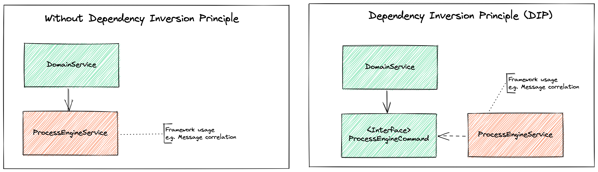

# Camunda DDD and Clean Architecture

An example to show how you could use clean architecture and DDD and their advantages with Camunda.

I also wrote a blog post to show how clean architecture could help you to update to Camunda Platform 8 without 
touching your domain centered code: [How Clean Architecture helps you migrating Camunda Platform 7 to 8](https://www.novatec-gmbh.de/en/blog/how-clean-architecture-helps-you-migrating-camunda-platform-7-to-8/).

## 🚀Features

The [BPMN process](assets/processes/loan_agreement.png) which start a [second process](assets/processes/cross_selling_recommendation.png) via message correlation should represent a tiny business process just to demonstrate the architecture.

### 🛫Start the process

With the following POST request, you could start the process:

```curl
curl --request POST \
  --url http://localhost:8080/loan/agreement/1 \
  --header 'Content-Type: application/json' \
  --data '
  "customerNumber": "A-11",
  "name": "Tester",
  "mailAddress": "tester@web.io",
  "amount": 1100
}'
```

Using the admin user (`username: admin` and `password: pw`) you could log in to the Camunda Cockpit.

### ↔️Migration to Camunda Platform 8

All necessary change to upgrade from Camunda Platform 7 to 8 are shown in [this pull request](https://github.com/lwluc/camunda-ddd-and-clean-architecture/pull/1).
The only changed files are all placed in the adapter layer. So the domain does not need to be touched to change a framework.

## 🏗Architecture

The following sections contain some small aspects explaining the advantages of Domain-driven Design (DDD) and clean architecture.

Flexibility around your domain (e.g., switching from Camunda 7 to Camunda 8) is the main focus I want to show you in this little example.

### Clean Architecture

A software architecture that integrates changeability in their package and class structure makes it easy to switch or migrate a framework. 
So the migration of Camunda Platform 7 to 8 is much less painful with a good architecture.


*The layers of clean architecture (based on Clean Architecture by Robert C. Martin)*

Robert C. Martin describes architectural guidelines in his book "[Clean Architecture](https://blog.cleancoder.com/uncle-bob/2012/08/13/the-clean-architecture.html)", 
which should allow independence of frameworks, databases, user interface (UI) and other technologies. 
In his opinion, clean architecture ensures the testability of business rules by its design. 
The image above displays layers as concentric circles wrapping each other. 
Each layer represents different parts of software. 
The center of the circle represents "policies" and thus your business rules and domain knowledge. 
The outer circles are "mechanisms" supporting our domain center. 
Beside the layers, the arrows show the dependency rule – only inward point dependencies! 
To reach the goals of clean architecture, the domain code must not have any dependencies pointing outwards. 
Instead, all dependencies point towards the domain code.
The essential aspect of your business domain is placed in the core of the architecture: 
the entities. They are only accessed by the surrounding layer: the use cases. 
Services in a classic layered architecture represent use cases in a clean architecture, 
but these services should be more fine-grained so that they have only one responsibility. 
You do not want one big service implementing all your business use cases. 
Supporting components are placed around the core (your entities and use cases), such as persistence or user interfaces.


#### Dependency Inversion Principle

When the dependency rule is applied, the domain has no knowledge about how you persist your 
data or how you display them in any client. 
The domain should not contain any framework code (arguably Dependency Injection). 
As I already mentioned, you could use the Dependency Inversion Principle (DIP) to apply the 
dependency rule of clean architecture. The DIP tells you to reverse the direction of a dependency. 
You may be thinking of the Inversion of Control (IoC) design pattern, which is not the same as DIP, 
although they fit well together. If you want to know the exact differences 
I recommend reading Martin Fowlers article "[DIP in the Wild](https://martinfowler.com/articles/dipInTheWild.html#YouMeanDependencyInversionRight)" (in short: "[...] IoC is about direction, 
and DIP is about shape."). The following figure shows an example of how the DIP works.


*The Dependency Inversion Principle (DIP)*

Imagine having a service (DomainService in the image) which starts a Camunda Process. 
To isolate your service (your business logic) from the framework, you could create another service using the 
Camunda Java API to start a process instance. The left frame of the image shows this scenario without applying the DIP. 
The domain service calls the ProcessEngineService directly. So what's the problem? Starting a process 
is a core aspect of our domain, so we want to pull it into our domain. By doing so, we break the rule of keeping 
our domain framework-agnostic. We can fix this, by placing an interface in our domain core instead of the 
concrete implementation and place the actual implementation outside of our domain layer, et voilà we apply the DIP.

Combining the DIP with the [Ports and Adapters](http://alistair.cockburn.us/Hexagonal+architecture) architecture (the clean architecture emerged of), 
we get the picture shown below.


*Clean architecture DIP and ports and adapters*

Separating our ports / use cases and adapters that drive our application (input-ports) or are driven by our 
application (output-ports) helps us to structure our code even more and to keep the boundaries more clear.

#### Mapping between layers

The following image shows how the layers interact with the domain object with and without mapping. 
Without mapping, you miss the biggest advantage of clean architecture: 
decoupling your domain core with the outer (infrastructure) layers. 
If you do not map between your inner and outer layers, you are not isolated. 
If a third-party system changes its data model, your domain model needs to change as well. 
To prevent dependence on external influencing factors and to promote independence and decoupling, 
it is necessary to map between the layers. 
Using the input and output ports (use case layer) as gatekeepers into your domain core, 
they define how to communicate and interact with your application. 
They provide a clear API and by mapping into your domain you keep it independent of any framework 
or technology model changes.


*With and without mapping between layers*

The frame explaining the mapping approach is just one possible way of mapping. 
If you want to know more about different stages of mapping, take a look a 
Tom Hombergs book "[Get Your Hands Dirty on Clean Architecture](https://leanpub.com/get-your-hands-dirty-on-clean-architecture)", he explains them pretty well.
In conclusion, mapping can be used to achieve greater decoupling. On the other hand, 
mapping between each layer could produce a lot of boilerplate code, which might be overkill 
depending on your use case and the goals you are working towards.

### Domain-driven Design

Using clean architecture as architecture style combines perfectly with Domain-driven Design because we completely focus on our domain core (entities and use cases).
In my opinion, Domain-driven Design (DDD) perfectly combines with clean architecture due to the fact that DDD is focused on your business domain. 
Focusing on your domain is supported by the goal of clean architecture, keeping the domain free of any framework or technologies. 
E.g. your domain does not focus on how to persist something, it just tells the outgoing port to save it. 
The implementation of the port (placed on the adapter layer) decides to use, e.g., relational or non-relational databases.

Beside the matching goal of DDD and clean architecture, DDD tries to help you build complex designs around your domain,
by e.g., building immutable objects that know all about their invariants, which helps you even more to structure your code.

DDD Elements like Aggregate Entities and ValueObject can be found in our [domain-primitives](https://github.com/domain-primitives/domain-primitives-java) library.

Structuring your code functional and brining more context to your object with, e.g. Value Object does not only help you to keep your code expressive, it also helps keeping it close to your business as your BPMN model.

## 🙏🏼Credits

Thanks to [Matthias Eschhold](https://github.com/MatthiasEschhold) for the passionate discussion around DDD and clean architecture. 
Matthias published a nice blog series: [Clean Architecture and flexibility patterns](https://github.com/MatthiasEschhold/clean-architecture-and-flexibility-patterns)

## 📨Contact

If you have any questions or ideas, feel free to contact me or create an [issue](https://github.com/lwluc/camunda-ddd-and-clean-architecture/issues).